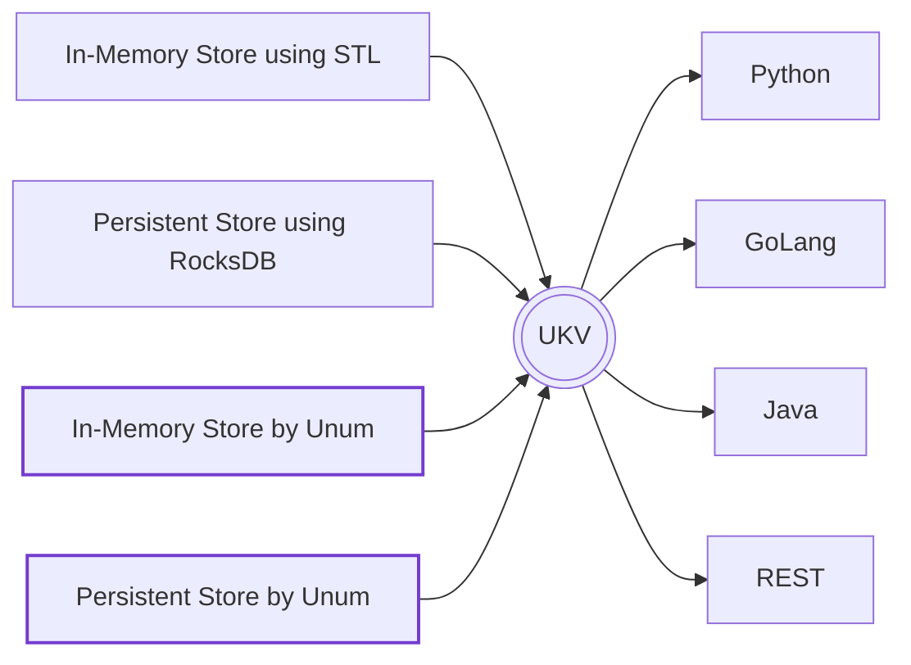

# Universal Key-Values

Universal Key-Value store interface for both in-memory and persistent ACID transactional collections written in C/C++ and Assembly with bindings for [Python](#python), [GoLang](#golang), [Java](#java), JavaScript, C#.



Assumptions and limitations:

* Keys are constant length native integer types. High-performance solutions are impossible with variable size keys. 64-bit unsigned integers are currently chosen as the smallest native numeric type, that can address modern datasets.
* Values are serialized into variable-length byte strings.
* Iterators and enumerators often come with certain relevance, consistency or performance tradeoffs or aren't supported at all. Check the specs of exact backend.
* Transactions are ACI(D) by-default, meaning that:
  * Atomicity is guaranteed,
  * Consistency is implemented in the strongest form - tracking all key and metadata lookups by default,
  * Isolation is guaranteed, but may be implemented differently, depending on backend - in-memory systems generally prefer "locking" over "multi-versioning".
  * Durability doesn't apply to in-memory systems, but even in persistent stores its often disabled to be implemented in higher layers of infrastructure.

## Development

To build and test any set of bindings:

1. Build (`cmake . && make`) or download the prebuilt `libukv.a`,
2. Call `./language/run.sh` in your terminal.

### Python

Current impleentation relies on [PyBind11](https://github.com/pybind/pybind11).
It's feature-rich, but not very performant, supporting:

* Named Collections
* Transactions
* Single & *Batch* Operations
* *Tensor Exports*

Using it can be as easy as:

```python
import ukv

db = ukv.DataBase()
db[42] = 'purpose of life'.encode()
db['sub-collection'][0] = db[42]
del db[42]
assert len(db['sub-collection'][0]) == 15
```

All familiar Pythonic stuff!

### Java

These bindings are impemented via [Java Native Interface](https://docs.oracle.com/javase/8/docs/technotes/guides/jni/spec/jniTOC.html).
This interface is more performant than Python, but is feature complete yet.
It mimics native `HashMap` and `Ditionary` classes, but has no support for batch operations yet.

```java
DataBase db = new DataBase("");
db.put(42, "purpose of life".getBytes());
assert db.get(42) == "purpose of life".getBytes() : "Big surprise";
db.close();
```

All `get` requests cause memory allocations in Java Runtime and export data into native Java types.
Most `set` requests will simply cast and forward values without additional copies.
Aside from opening and closing this class is **thread-safe** for higher interop with other Java-based tools.

Implementation follows the ["best practices" defined by IBM](https://developer.ibm.com/articles/j-jni/).

### GoLang

GoLang bindings are implemented using [cGo](https://pkg.go.dev/cmd/cgo).
The language lacks operator and function overloads, so we can't mimic native collections.
Instead we mimic the interfaces of most commonly used ORMs.

```go
db := DataBase{}
db.Reconnect("")
db.Set(42, &[]byte{4, 2})
db.Get(42)
```

Implementation-wise, GoLang variant performs `memcpy`s on essentially every call.
As GoLang has no exceptions in the classical OOP sense, most functions return multiple values, error being the last one in each pack.
Batch lookup operations are imlemented via channels sending slices, to avoid reallocations.

### RESTful API & Clients

We implement a REST server using `Boost.Beast` and the underlying `Boost.Asio`, as the go-to Web-Dev libraries in C++.
We also provide a [`OneAPI` specification](/openapi.yaml), that is used as both a documentation point and an automatic client-library generator.
The entire list of generators is [available here](https://openapi-generator.tech/docs/generators/);

```sh
npm install @openapitools/openapi-generator-cli -g
npx openapi-generator-cli generate -i openapi.yaml -g html2 -o /tmp/
```

Or via Docker:

```sh
docker run --rm -v "${PWD}:/local" openapitools/openapi-generator-cli generate \
    -i "/local/openapi.yaml" \
    -g html2 \
    -o "/local/tmp/"
```

## TODOs

At this point we alerady have a pretty big number of frontends and backends ready.

```sh
cloc $(git ls-files)
```

Yields following output:

```txt
-------------------------------------------------------------------------------
Language                     files          blank        comment           code
-------------------------------------------------------------------------------
C++                              5            325            455           1556
C                                3             68             21            264
Python                           5             93             33            244
Java                             1             45            133            150
C/C++ Header                     4             55            322            141
Go                               2             34             32            116
Markdown                         1             36              0            106
YAML                             2             11              1            104
CMake                            1             23             56             83
Protocol Buffers                 1             19              0             49
JSON                             1              0              0             16
Bourne Shell                     3              3              8             15
-------------------------------------------------------------------------------
SUM:                            29            712           1061           2844
-------------------------------------------------------------------------------
```

Here are our next tasks

* [ ] More tests in Python
* [ ] GoLang memory pinning Channel Batch Reads of [slices](https://stackoverflow.com/a/36546929)
* [ ] Swift Bindings
* [ ] Rust Bindings
* [ ] Scala Bindings
* [ ] Wolfram Language Bindings
* [ ] Read/Write Apache Arrow Tables via C API
* [ ] Java Apache Arrow support
* [ ] Fill the [OpenAPI specification](openapi.yaml)
