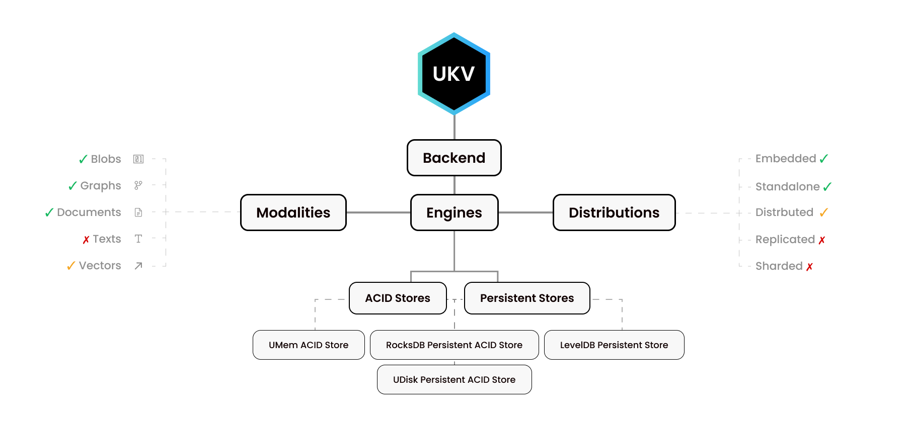
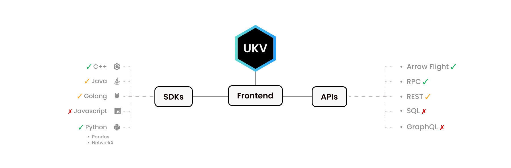

<h1 align="center">UKV</h1>
<h3 align="center">
Universal Binary Interface<br/>
For the Fastest Databases in Existence<br/>
From <a href="https://unum.cloud">Unum</a> with ❤️
</h3>

<h5 align="center">
RocksDB • LevelDB • UDisk • UMem<br/>
Blobs • Documents • Graphs • Texts • Vectors<br/>
C • C++ • Python • Java • GoLang • Apache Arrow
</h5>
<br/>

<p align="center">
<a href="https://twitter.com/unum_cloud"></a>
&nbsp;&nbsp;
<a href="https://www.linkedin.com/company/unum-cloud/"></a>
&nbsp;&nbsp;
<a href="https://www.github.com/unum-cloud/"></a>
&nbsp;&nbsp;
<a href="https://www.github.com/unum-cloud/"></a>
&nbsp;&nbsp;
<a href="#"></a>
</p>

## What is UKV?

**UKV is an open C-layer binary standard** for "Create, Read, Update, Delete" operations, or CRUD for short.

Many databases exist today, providing similar functionality and performance under different interfaces.
It is a problem for DBMS users, introducing vendor locks and additional friction for adopting newer and better technologies.

If databases do similar things, let's standardize the interface and compete for the best implementation.
That way, migrations are more manageable, and the system can be modularized into parts, giving users absolute flexibility in choosing between different:

* Forms of data, or [Modalities](#modalities),
* Key-Value Store implementations, or [Engines](#engines),
* Distribution forms, or Packaging,
* Client SDKs, or [Frontends](#frontends) for higher-level languages.

---

## The [BLAS][blas] of [CRUD][crud]

Generic standards have existed in computing since 1979.
The best one is called **BLAS** and was the locomotive of Numerical Methods across all disciplines in the past 50 years. 
Every deep-learning you use relies on BLAS.
What is the standard that your DBMS can be built around?


We have yet to pass the test of time, like BLAS, but we can surpass them in modularity and provide a better reference implementation.
Today, Intel, Nvidia, AMD, GraphCore, Cerebras, and many others ship optimized implementations of BLAS for their hardware.
Similarly, we ship proprietary [heavily-tested](#testing) and [extensively-benchmarked](#benchmarks) implementations of UKV to our customers.
Still, we want the Community Edition to be a major improvement over modern OLTP DBMS solutions of today.

> [Why not use LevelDB or RocksDB interface directly?][ukv-vs-rocks]

---

## Features

We love to think about UKV as a "Transactional <sup>1</sup> Zoned <sup>2</sup> Memory Allocator <sup>3</sup>" that can abstract both persistent and volatile memory.
This abstraction every DBMS needs.
But UKV has more to offer!

<table>
<td style="text-align: center">

<ul>
<li> <b>ACID Transactions</b> across collections  </li>
<li> Persistent <b>Snapshots</b> </li>
<li> Operation-level <b>WATCH</b>-es  </li>
<li> <b>BSON, JSON, MessagePack</b> documents support  </li>
<li> <b>JSON Patches</b> & Merge-Patches  </li>
<li> <b>JSON Pointers</b> Addressing  </li>
</ul>

</td>
<td style="text-align: center">

<ul>
<li> Native Apache <b>Arrow</b> format support </li>
<li> Apache <b>Arrow Flight</b> server implementation </li>
<li> <b>Bulk Scans</b>, Random <b>Samping</b> </li>
<li> <b>Pandas</b> Tabular interface  </li>
<li> <b>NetworkX</b> Graph interface  </li>
<li> <b>PyTorch</b> & <b>TensorFlow</b> Data-Loaders </li>
</ul>
</td>
</table>

> 1: For [ACID][acid].
> 2: For having named collections.
> 3: Because keys are integers, like `uintptr_t`, and values are virtually continuous memory blocks of variable length.

## [HTAP][htap]: [OLAP][olap] + [OLTP][oltp]

Thanks to modular architecture, you can take the pieces you need.
The most apparent combinations would cover the most immediate use cases like:

1. Getting a Python, GoLang, or Java wrapper for vanilla RocksDB or LevelDB.
2. Serving them via Apache Arrow Flight RPC to Spark, Kafka, or PyTorch.
3. Embedded Document and GraphDB that will avoid networking overheads.
4. Tiering DBMS deployment between UMem and persistent memory.

But that is just the peak of the iceberg.
Let's dive under the surface of our data lake.

### **🐦🐦 + 🪨 → ☠️☠️**

It is normal these days to have hundreds of Databases for one project.
At least one for every kind of workload.
So if you are building an online marketplace, it may look like this:

|                                           |                                               |
| :---------------------------------------: | :-------------------------------------------: |
| Postgres for account details and payments | MongoDB for products descriptions and reviews |
|      Neo4J to link related products       |  AWS S3 to store product pictures and videos  |
|       ClickHouse for activity logs        |      Redis for real-time sessions state       |

When the data is updated, you have to apply changes across all those instances, manually rolling them back if one of the parts fails.
Every system has a different API, different guarantees, and runtime constraints.
For us it sounded like too many **wasted engineering hours**.

> ... So we have spent years fixing that 😅


As it is not one store, different teams work on different versions of data.
Some of those datasets can quickly become irrelevant, especially in:

* Fraud Detection, where parties constantly adapt,
* Recommender Systems, if new products and content appear every day,
* Real-Time Pricing, where market conditions dictate the cost of services.

By the time row-major OLTP data is exported into the column-major OLAP store, it might be too late.
Every data scientist knows - "Garbage In, Means Garbage Out".
Outdated input will give you an obsolete result, and the business will lose money.

But if you have just 1 Hybrid Store, the pain is gone.
And the engineering teams can spend time doing something productive rather than packaging and versioning endless Parquet files around your system.

### **One Data Lake to Serve Them All**

---

## Backend

A backend is a composition of just 2-3 parts.
An Engine, being a key-value store for the serialized representation.
An implementation of Modalities, being various serialization and indexing approaches for structured data.
And a Distribution form, such as the implementation of some web-protocol for communication with the outside world.



Our horizontal scaling capabilities aren't ideal **yet**.
Sharding graphs and vector collections is hard.
We can do it at least as bad as the others are doing it, but we don't want to stop there.
More news to come.

Our **vertical scaling**, however, **is the best in the industry**.
Even with just a single node, in a 2U chassis in 2022, we can quickly get 24x 16 TB of NVMe storage connected to 2x CPU sockets, totaling 384 TB of space, capable of yielding ~120 GB/s of read throughput, out of which, ~70 GB/s our in-house engine can already sustain.
With NVMe-oF, this can scale horizontally to Petabytes of low-latency storage served through 200 GBit/s [Mellanox][mellanox] InfiniBand fibers!
Combining it with the numerous features above and GPU acceleration, one can get an all-one Data Lake with the feel of [Pandas][pandas], [Rapids][rapids] speed, [Hadoop][hadoop] scale, and [Postgres][postgres] consistency.

### Engines

Following engines can be used almost interchangeably.
Historically, LevelDB was the first one.
RocksDB then improved on functionality and performance.
Now it serves as the foundation for half of the DBMS startups.

|                          | LevelDB | RocksDB  |  UDisk  |  UMem   |
| :----------------------- | :-----: | :------: | :-----: | :-----: |
| **Speed**                |   1x    |    2x    | **10x** | **30x** |
| **Persistent**           |    ✓    |    ✓     |    ✓    |    ✗    |
| **Transactional**        |    ✗    |    ✓     |    ✓    |    ✓    |
| **Block Device Support** |    ✗    |    ✗     |    ✓    |    ✗    |
| Encryption               |    ✗    |    ✗     |    ✓    |    ✗    |
| [Watches][watch]         |    ✗    |    ✓     |    ✓    |    ✓    |
| [Snapshots][snap]        |    ✓    |    ✓     |    ✓    |    ✗    |
| Random Sampling          |    ✗    |    ✗     |    ✓    |    ✓    |
| Bulk Enumeration         |    ✗    |    ✗     |    ✓    |    ✓    |
| Named Collections        |    ✗    |    ✓     |    ✓    |    ✓    |
| Open-Source              |    ✓    |    ✓     |    ✗    |    ✓    |
| Compatibility            |   Any   |   Any    |  Linux  |   Any   |
| Maintainer               | Google  | Facebook |  Unum   |  Unum   |

UMem and UDisk are both designed and maintained by Unum.
Both are feature-complete, but the most crucial feature our infrastructure provides is performance.
Being fast in memory is easy.
The core logic of UMem can be found in the templated header-only <code class="docutils literal notranslate"><a href="https://github.com/ashvardanian/consistent_set" class="pre">consistent_set</a></code> library.


Designing UDisk was a much more challenging 7-year long endeavour.
It included inventing new tree-like structures, implementing partial kernel bypass with `io_uring`, complete bypass with `SPDK`, GPU acceleration, and even a custom internal filesystem.
**UDisk is the first engine to be designed from scratch with parallel architectures and kernel-bypass in mind**.

> [Jump to Benchmarks](#benchmarks).

### Modalities

The same DBMS can contain multiple collections.
Each collection can store BLOBs or any modality of structured data.
Data of different modalities can't be stored in the same collection.
ACID transactions across modalities are supported.

|                           |                     Documents                      |                 Graphs                 |                       Vectors                        |
| :------------------------ | :------------------------------------------------: | :------------------------------------: | :--------------------------------------------------: |
| Values                    |           JSON-like Hierarchical Objects           |       Labeled Directed Relations       |             High-Dimensional Embeddings              |
| Specialized Functionality | JSON ⇔ BSON ⇔ MessagePack, Sub-Document Operations | Gather Neighbors, Count Vertex Degrees | Quantization, K-Approximate Nearest-Neighbors Search |
| Examples                  |              MongoDB, Postgres, MySQL              |           Neo4J, TigerGraph            |               Elastic Search, Pinecone               |

One of our core objectives was to select the minimal core set of functions for each modality.
In that case, implementing them can be easy for any passionate developer.
If the low-level interfaces are flexible, making the high-level interfaces rich is easy.

## Frontend: SDK ∨ API

UKV for Python and for C++ look very different.
Our Python SDK mimics other Python libraries - [Pandas][pandas] and [NetworkX][networkx].
Similarly, C++ library provides the interface C++ developers expect.



As we know people use different languages for different purposes.
Some C-level functionality isn't implemented for some languages.
Either because there was no demand for it, or as we haven't gotten to it yet.


| Name             | Transact | Collections | Batches | Docs  | Graphs | Copies |
| :--------------- | :------: | :---------: | :-----: | :---: | :----: | :----: |
| C Standard       |    ✓     |      ✓      |    ✓    |   ✓   |   ✓    |   0    |
|                  |          |             |         |       |        |        |
| C++ SDK          |    ✓     |      ✓      |    ✓    |   ✓   |   ✓    |   0    |
| Python SDK       |    ✓     |      ✓      |    ✓    |   ✓   |   ✓    |  0-1   |
| GoLang SDK       |    ✓     |      ✓      |    ✓    |   ✗   |   ✗    |   1    |
| Java SDK         |    ✓     |      ✓      |    ✗    |   ✗   |   ✗    |   1    |
|                  |          |             |         |       |        |        |
| Arrow Flight API |    ✓     |      ✓      |    ✓    |   ✓   |   ✓    |  1-2   |

Some frontends here have entire ecosystems around them!
[Apache Arrow Flight][flight] API, for instance, has its own bindings for  C, C++, C#, Go, Java, JavaScript, Julia, MATLAB, Python, R, Ruby and Rust.


---

## Documentation

For guidance on installation, development, deployment, and administration, see our [documentation](https://unum.cloud/UKV).

## Installation

The entire DBMS fits into a sub 100 MB Docker image.
Run the following script to pull and run the container, exposing [Apache Arrow Flight][flight] API server on the port `38709`.
Client SDKs will also communicate through that same port, by default.

```sh
docker run --rm --name TestUKV -p 38709:38709 unum/ukv
```

For C/C++ clients and for the embedded distribution of UKV, CMake is the default form of installation.
It may require installing Arrow separately.

```cmake
FetchContent_Declare(
    ukv
    GIT_REPOSITORY https://github.com/unum-cloud/UKV.git
    GIT_SHALLOW TRUE
)
FetchContent_MakeAvailable(ukv)
include_directories(${ukv_SOURCE_DIR}/include)
```

After that, you only need to choose linking target, such as `ukv_rocksdb`, `ukv_umem`, `ukv_flight_client`, or something else.

For Python users, it is the classical:

```sh
pip install ukv
```

Which will bring all the libraries packed into a single wheel: `ukv.umem`, `ukv.rocksdb`, `ukv.leveldb`, `ukv.flight_client`.

> [Read full installation guide in our docs here][ukv-install].

## Getting Started

* [Using the C Standard Directly][ukv-c-tutor]
  * Most Flexible!
  * Most Performant!
  * Comparatively verbose.
* [Using C++ SDK][ukv-cpp-tutor]
* [Using Python SDK][ukv-python-tutor]
* [Using Java SDK][ukv-java-tutor]
* [Using GoLang SDK][ukv-golang-tutor]
* [Using Arrow Flight API][ukv-flight-tutor]

## Testing

We split tests into 4 categories:

1. Compilation: Validate meta-programming.
2. API: Prevent passing incompatible function arguments.
3. Unit: Short and cover most of the functionality.
4. **Stress**: Very long and multithreaded.

All unit tests are packed into a single executable to simplify running it during development.
Every backend produces one such executable.
The in-memory embedded variant is generally used for debugging any non-engine level logic.

The stress tests, on the other hand, can run for days and simulate millions of concurrent transactions, ensuring the data remains intact.
Any additions, especially to the stress tests, will be highly welcomed!

> [Read full testing guide in our docs here][ukv-tests].

## Benchmarks

It is always best to implement an application-specific benchmark, as every use case is different.
Still, for the binary layer logic, we have built a dedicated project to evaluate persistent data structures - [UCSB][ucsb].
It doesn't depend on UKV and uses native interfaces of all the engines to put everyone in the same shoes.

All engines were benchmarked for weeks using [UCSB][ucsb].
We have already published the results for BLOB-layer abstractions for [10 TB][ucsb-10], and, previously, [1 TB][ucsb-1] collections.

For more advanced modality-specific workloads, we have the following benchmarks provided in this repo:

* **Twitter**. It takes the `.ndjson` dump of their <code class="docutils literal notranslate"><a href="https://developer.twitter.com/en/docs/twitter-api/v1/tweets/sample-realtime/overview" class="pre">GET statuses/sample API</a></code> and imports it into the Documents collection. We then measure random-gathers' speed at document-level, field-level, and multi-field tabular exports. We also construct a graph from the same data in a separate collection. And evaluate Graph construction time and traversals from random starting points.
* **Tabular**. Similar to the previous benchmark, but generalizes it to arbitrary datasets with some additional context. It supports Parquet and CSV input files.
* **Vector**. Given a memory-mapped file with a big matrix, builds an Approximate Nearest Neighbors Search index from the rows of that matrix. Evaluates both construction and query time.

We are working hard to prepare a comprehensive overview of different parts of UKV compared to industry-standard tools.
On both our hardware and most common instances across public clouds.

> [Read full benchmarking guide in our docs here][ukv-benchmarks].

## Tooling

Tools are built on top of the UKV interface and aren't familiar with the underlying backend implementation.
They are meant to simplify DevOps and DBMS management.
Following tools are currently in the works.

* Bulk dataset imports and exports for industry-standard Parquet, NDJSON and CSV files.
* Rolling backups and replication.
* Visualization tools and dashboards.

> [Read full tooling guide in our docs here][ukv-tools].

## Development & Licensing

This is an umbrella project for a number of FOSS libraries.
Sometimes a couple of libraries can be used together for the same task to complement each other functionality.
For example, `simdjson` is used for document validation and sampling, while `yyjson` is used for updates.

A full list of dependencies is available at the link below, together with detailed descriptions of reference implementations.
Licensing depends on which parts you are using.

> [Read full development and contribution guide in our docs here][ukv-details].

## Presets, Limitations and FAQ

* Keys are 64-bit integers, by default. [Why?][ukv-keys-size]
* Values are binary strings under 4 GB long. [Why?][ukv-values-size]
* Transactions are ACI(D) by-default. [What does it mean?][ukv-acid]
* Why not use LevelDB or RocksDB interface? [Answered][ukv-vs-rocks]
* Why not use SQL, MQL or Cypher? [Answered][ukv-vs-sql]

[ukv-c-tutor]: https://unum.cloud/UKV/c
[ukv-cpp-tutor]: https://unum.cloud/UKV/cpp
[ukv-python-tutor]: https://unum.cloud/UKV/python
[ukv-java-tutor]: https://unum.cloud/UKV/java
[ukv-golang-tutor]: https://unum.cloud/UKV/golang
[ukv-flight-tutor]: https://unum.cloud/UKV/flight
[ukv-tests]: https://unum.cloud/UKV/tests
[ukv-benchmarks]: https://unum.cloud/UKV/benchmarks
[ukv-tools]: https://unum.cloud/UKV/tools
[ukv-install]: https://unum.cloud/UKV/install
[ukv-details]: https://unum.cloud/UKV/details
[ukv-keys-size]: https://unum.cloud/UKV/c#integer-keys
[ukv-values-size]: https://unum.cloud/UKV/c#smallish-values
[ukv-acid]: https://unum.cloud/UKV/c#acid-transactions
[ukv-vs-rocks]: https://unum.cloud/UKV/related#leveldb-rocksdb
[ukv-vs-sql]: https://unum.cloud/UKV/related#sql-mql-cypher

[ucsb-10]: https://unum.cloud/post/2022-03-22-ucsb
[ucsb-1]: https://unum.cloud/post/2021-11-25-ycsb
[ucsb]: https://github.com/unum-cloud/ucsb
[consistent_set]: https://github.com/ashvardanian/consistent_set
[ukv-c-sources]: https://github.com/unum-cloud/UKV/tree/main/include/ukv

[blas]: https://en.wikipedia.org/wiki/Basic_Linear_Algebra_Subprograms
[crud]: https://en.wikipedia.org/wiki/Create,_read,_update_and_delete
[acid]: https://en.wikipedia.org/wiki/ACID
[arrow]: https://arrow.apache.org/
[patch]: https://datatracker.ietf.org/doc/html/rfc6902
[mpack]: https://msgpack.org/index.html
[flight]: https://arrow.apache.org/docs/format/Flight.html
[pointer]: https://datatracker.ietf.org/doc/html/rfc6901
[bson]: https://www.mongodb.com/json-and-bson
[pytorch]: https://pytorch.org/
[tensorflow]: https://tensorflow.org
[rocksdb]: https://rocksdb.org
[leveldb]: https://github.com/google/leveldb
[hadoop]: https://hadoop.apache.org
[networkx]: https://networkx.org
[pandas]: https://pandas.pydata.org
[gunrock]: https://gunrock.github.io
[s3]: https://aws.amazon.com/s3
[dbms-cloc]: https://news.ycombinator.com/item?id=24813239
[watch]: https://redis.io/commands/watch/
[snap]: https://github.com/facebook/rocksdb/wiki/Snapshot
[olap]: https://en.wikipedia.org/wiki/Online_analytical_processing
[oltp]: https://en.wikipedia.org/wiki/Online_transaction_processing
[htap]: https://en.wikipedia.org/wiki/Hybrid_transactional/analytical_processing
[mellanox]: https://www.nvidia.com/en-us/networking/products/infiniband/
[rapids]: https://rapids.ai/
[postgres]: https://www.postgresql.org/
