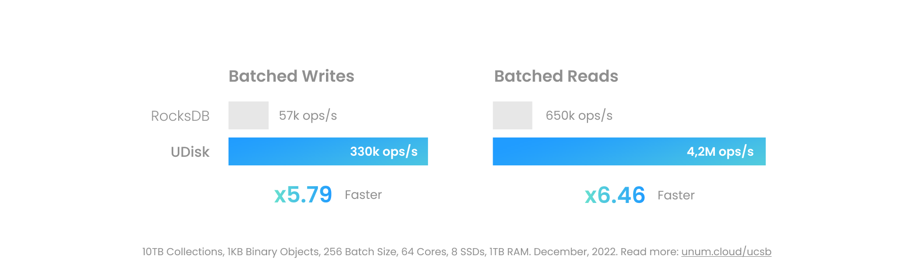
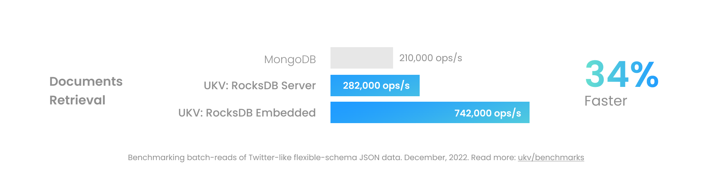

<h1 align="center">UStore</h1>
<h3 align="center">
Modular <sup>1</sup> Multi-Modal <sup>2</sup> Transactional <sup>3</sup> Database<br/>
For Artificial Intelligence <sup>4</sup> and Semantic Search <sup>5</sup><br/>
</h3>
<br/>

<p align="center">
<a href="https://www.youtube.com/watch?v=ybWeUf_hC7o"></a>
&nbsp;&nbsp;&nbsp;
<a href="https://discord.gg/4mxGrenbNt"></a>
&nbsp;&nbsp;&nbsp;
<a href="https://www.linkedin.com/company/unum-cloud/"></a>
&nbsp;&nbsp;&nbsp;
<a href="https://twitter.com/unum_cloud"></a>
&nbsp;&nbsp;&nbsp;
<a href="https://unum.cloud/post"></a>
&nbsp;&nbsp;&nbsp;
<a href="https://github.com/unum-cloud/ukv"></a>
</p>

<div align="center">
1. supports:
<a href="https://github.com/facebook/rocksdb">RocksDB</a>
•
<a href="https://github.com/google/leveldb">LevelDB</a>
•
<a href="https://github.com/unum-cloud/udisk">UDisk</a>
•
<a href="https://github.com/unum-cloud/ucset">UCSet</a>
<a href="backends">backends</a>
<br/>
2. can store:
<a href="#Blobs">Blobs</a>
•
<a href="#Documents">Documents</a>
•
<a href="#Graphs">Graphs</a>
•
🔜 Features
•
🔜 Texts
<br/>
3: guarantees
<a href="#Atomicity">Atomicity</a>
•
<a href="#Consistency">Consistency</a>
•
<a href="#Isolation">Isolation</a>
•
<a href="#Durability">Durability</a>
<br/>
4: comes with
Pandas
and
NetworkX
API
and 🔜
PyTorch data-loaders
<br/>
5: brings
vector-search
integrated with
<a href="https://github.com/unum-cloud/usearch">USearch</a>
and
<a href="https://github.com/unum-cloud/uform">UForm</a>
</div>

---

<div align="center">
<b>drivers</b>:
Python
•
C
•
C++
•
GoLang
•
Java
<br/>
<b>packages</b>:
<a href="https://pypi.org/project/ustore/">PyPI</a>
•
<a href="#cmake">CMake</a>
•
<a href="https://hub.docker.com/repository/docker/unum/ustore">Docker Hub</a>

<a href="https://www.youtube.com/watch?v=ybWeUf_hC7o">Youtube</a> intro • 
<a href="https://discord.gg/4mxGrenbNt">Discord</a> chat • 
Full <a href="https://unum-cloud.github.io/ustore">documentation</a>

<a href="https://discord.gg/4mxGrenbNt"></a>
&nbsp;&nbsp;
<a href="https://www.linkedin.com/company/unum-cloud/"></a>
&nbsp;&nbsp;
<a href="https://twitter.com/unum_cloud"></a>
&nbsp;&nbsp;
<a href="https://zenodo.org/badge/latestdoi/502647695"></a>
&nbsp;&nbsp;
<a href="https://www.github.com/unum-cloud/"></a>
&nbsp;&nbsp;
<a href="https://www.github.com/unum-cloud/"></a>
&nbsp;&nbsp;
<a href="#"></a>
</div>

## Quickstart

Installing UStore is a breeze, and the usage is about as simple as a Python `dict`.

```python
$ pip install ukv
$ python

from ukv import umem

db = umem.DataBase()
db.main[42] = 'Hi'
```

We have just create an in-memory embedded transactional database and added one entry in its `main` collection.
Would you prefer that data on disk?
Change one line.

```python
from ukv import rocksdb

db = rocksdb.DataBase('/some-folder/')
```

Would you prefer to connect to a remote UStore server?
UStore comes with an Apache Arrow Flight RPC interface!

```python
from ukv import flight_client

db = flight_client.DataBase('grpc://0.0.0.0:38709')
```

Are you storing [NetworkX][networkx]-like `MultiDiGraph`?
Or [Pandas][pandas]-like `DataFrame`?

```python
db = rocksdb.DataBase()

users_table = db['users'].table
users_table.merge(pd.DataFrame([
    {'id': 1, 'name': 'Lex', 'lastname': 'Fridman'},
    {'id': 2, 'name': 'Joe', 'lastname': 'Rogan'},
]))

friends_graph = db['friends'].graph
friends_graph.add_edge(1, 2)

assert friends_graph.has_edge(1, 2) and \
    friends_graph.has_node(1) and \
    friends_graph.number_of_edges(1, 2) == 1
```

Function calls may look identical, but the underlying implementation can be addressing hundreds of terabytes of data placed somewhere in persistent memory on a remote machine.

---

Is someone else concurrently updating those collections?
Bundle your operations to guarantee consistency!

```python
db = rocksdb.DataBase()
with db.transact() as txn:
    txn['users'].table.merge(...)
    txn['friends'].graph.add_edge(1, 2)
```

So far we have only covered the tip of the UStore.
You may use it to...

1. Get C99, Python, GoLang, or Java wrappers for RocksDB or LevelDB.
2. Serve them via Apache Arrow Flight RPC to Spark, Kafka, or PyTorch.
3. Store Document and Graphs in embedded DB, avoiding networking overheads.
4. Tier DBMS between in-memory and persistent backends under one API.

But UStore can more.
Here is the map:

- [Basic Usage](#basic-usage):
  - [Modalities](#modalities)
    - Storing [Blobs](#blobs)
    - Storing [Documents](#documents)
    - Storing [Graphs](#graphs)
    - Storing [Vectors](#vectors)
  - [Drivers](#drivers)
    - For [Python ∆][ustore-python]
    - For [C ∆][ustore-c]
    - For [C++ ∆][ustore-cpp]
    - For [GoLang ∆][ustore-golang]
    - For [Java ∆][ustore-java]
  - [AI Usecases ∆][ustore-ai]
  - [Frequently Questioned Answers](#frequently-questioned-answers)
  - [Frequently Asked Questions](#frequently-asked-questions)
- [Advanced Usage](#advanced-usage) for production, performance tuning, and administration:
  - [Engines](#engines)
  - [Transactions](#transactions)
    - [Atomicity](#atomicity)
    - [Consistency](#consistency)
    - [Isolation](#isolation)
    - [Durability](#durability)
  - [Containers and Cloud Deployments](#containers-and-cloud-deployments)
  - [Configuration](#configuration)
    - [Key Sizes](#key-sizes)
    - [Value Sizes](#value-sizes)
  - [Tools ∆][ustore-tools]
  - [Tests ∆][ustore-tests]
  - [Benchmarks ∆][ustore-benchmarks]
- For contributors and advanced users looking to fork, extend, wrap, or distribute and, potentially, monetize alternative builds of UStore:
  - [Architecture and Dependencies ∆][ustore-architecture]
  - [Roadmap ∆][ustore-roadmap]
  - [Contributing ∆][ustore-contributing]

[ustore-c]: https://unum.cloud/docs/ustore/c
[ustore-cpp]: https://unum.cloud/docs/ustore/cpp
[ustore-python]: https://unum.cloud/docs/ustore/python
[ustore-java]: https://unum.cloud/docs/ustore/java
[ustore-golang]: https://unum.cloud/docs/ustore/golang

[ustore-tests]: https://unum.cloud/docs/ustore/tests
[ustore-benchmarks]: https://unum.cloud/docs/ustore/benchmarks
[ustore-tools]: https://unum.cloud/docs/ustore/tools

[ustore-ai]: https://unum.cloud/docs/ustore/ai
[ustore-flight]: https://unum.cloud/docs/ustore/flight

[ustore-architecture]: https://unum.cloud/docs/ustore/architecture
[ustore-roadmap]: https://github.com/orgs/unum-cloud/projects/2
[ustore-contributing]: https://unum.cloud/docs/ustore/contributing

[ustore-c-headers]: https://github.com/unum-cloud/ustore/tree/main/include/ustore
[ustore-new-drivers]: https://github.com/unum-cloud/ustore/c#implementing-a-new-language-binding
[ustore-new-engine]: https://github.com/unum-cloud/ustore/c#implementing-a-new-engine


---

## Basic Usage

UStore is intended not just as database, but as "build your database" toolkit and an open standard for NoSQL potentially-transactional databases, defining zero-copy binary interfaces for "Create, Read, Update, Delete" operations, or CRUD for short.

A [few simple C99 headers][ustore-c-headers] can link almost any underlying storage [engine](#engines) to numerous high-level language [drivers](#drivers), extending their support for binary string values to graphs, flexible-schema documents, and other [modalities](#modalities), aiming to replace MongoDB, Neo4J, Pinecone, and ElasticSearch with a single ACID-transactional system.


[Redis][redis], for example, provides RediSearch, RedisJSON, and RedisGraph with similar objectives.
UStore does it better, allowing you to add your favorite Key-Value Stores (KVS), embedded, standalone, or sharded, such as [FoundationDB][foundationdb], multiplying its functionality.

### Modalities

#### Blobs

Binary Large Objects can be placed inside UStore.
The performance will vastly vary depending on the used underlying technology.
The in-memory UCSet will be the fastest, but the least suited for larger objects.
The persistent UDisk, when properly configured, can entirely bypass the the Linux kernel, including the filesystem layer, directly addressing block devices.



Modern persistent IO on high-end servers can exceed 100 GB/s per socket when built on user-space drivers like [SPDK][spdk].
This is close to the real-world throughput of high-end RAM and unlocks new, uncommon to databases use cases.
One may now put a Gigabyte-sized video file in an ACID-transactional database, right next to its metadata, instead of using a separate object store, like MinIO.

#### Documents

JSON is the most commonly used document format these days.
UStore document collections support JSON, as well as MessagePack, and BSON, used by MongoDB.



UStore doesn't scale horizontally yet, but provides much higher single-node performance, and has almost linear vertical scalability on many-core systems thanks to the open-source `simdjson` and `yyjson` libraries.
Moreover, to interact with data, you don't need a custom query language like MQL.
Instead we prioritize open RFC standards to truly avoid vendor locks:

- [JSON Pointer: RFC 6901][pointer] to address nested fields.
- [JSON Patch: RFC 6902][patch] for field-level updates.
- [JSON MergePatch: RFC 7386][merge-patch] for document-level updates.

[pointer]: https://datatracker.ietf.org/doc/html/rfc6901
[patch]: https://datatracker.ietf.org/doc/html/rfc6902
[merge-patch]: https://datatracker.ietf.org/doc/html/rfc7386

#### Graphs

Modern Graph databases, like Neo4J, struggle with large workloads.
They require too much RAM, and their algorithms observe data one entry at a time.
We optimize on both fronts:

- Using delta-coding to compress inverted indexes.
- Updating classical graph algorithms for high-latency storage to process graphs in Batch-like or Edge-centric fashion.

#### Vectors

Feature Stores and Vector Databases, like Pinecone, Milvus, and USearch provide standalone indexes for vector search.
UStore implements it as a separate modality, on par with Documents and Graphs.
Features:

- 8-bit integer quantization.
- 16-bit floating-point quantization.
- Cosine, Inner Product, and Euclidean metrics.

### Drivers

UStore for Python and for C++ look very different.
Our Python SDK mimics other Python libraries - [Pandas][pandas] and [NetworkX][networkx].
Similarly, C++ library provides the interface C++ developers expect.


As we know, people use different languages for different purposes.
Some C-level functionality isn't implemented for some languages.
Either because there was no demand for it, or as we haven't gotten to it yet.

| Name                        | Transact | Collections | Batches | Docs  | Graphs | Copies |
| :-------------------------- | :------: | :---------: | :-----: | :---: | :----: | :----: |
| [C99 Standard][ustore-c]    |    ✓     |      ✓      |    ✓    |   ✓   |   ✓    |   0    |
|                             |          |             |         |       |        |        |
| [C++ SDK][ustore-cpp]       |    ✓     |      ✓      |    ✓    |   ✓   |   ✓    |   0    |
| [Python SDK][ustore-python] |    ✓     |      ✓      |    ✓    |   ✓   |   ✓    |  0-1   |
| [GoLang SDK][ustore-golang] |    ✓     |      ✓      |    ✓    |   ✗   |   ✗    |   1    |
| [Java SDK][ustore-java]     |    ✓     |      ✓      |    ✗    |   ✗   |   ✗    |   1    |
|                             |          |             |         |       |        |        |
| Arrow Flight API            |    ✓     |      ✓      |    ✓    |   ✓   |   ✓    |  0-2   |

Some frontends here have entire ecosystems around them!
[Apache Arrow Flight][flight] API, for instance, has its own drivers for  C, C++, C#, Go, Java, JavaScript, Julia, MATLAB, Python, R, Ruby and Rust.


### Frequently Questioned Answers

- Keys are 64-bit integers, by default. [Why?](#key-sizes)
- Values are binary strings under 4 GB long. [Why?](#value-sizes)

### Frequently Asked Questions

- Transactions are ACI(D) by-default. [What does it mean?](#transactions)
- Why not use LevelDB or RocksDB interface? [Answered][ustore-vs-rocks]
- Why not use SQL, MQL or CYPHER? [Answered][ustore-vs-sql]
- Does UStore support Time-To-Live? [Answered][ustore-ttl]
- Does UStore support compression? [Answered][ustore-compression]
- Does UStore support queues? [Answered][ustore-queues]
- How can I add drivers for language X? [Answered][ustore-new-drivers]
- How can I add database X as an engine? [Answered][ustore-new-engine]

[ustore-vs-rocks]: https://unum.cloud/docs/ustore/related#leveldb-rocksdb
[ustore-vs-sql]: https://unum.cloud/docs/ustore/related#sql-mql-cypher

[ustore-ttl]: https://github.com/unum-cloud/ustore/discussions/230
[ustore-compression]: https://github.com/unum-cloud/ustore/discussions/232
[ustore-queues]: https://github.com/unum-cloud/ustore/discussions/228

## Advanced Usage

### Engines

Following engines can be used almost interchangeably.
Historically, LevelDB was the first one.
RocksDB then improved on functionality and performance.
Now it serves as the foundation for half of the DBMS startups.

|                          | LevelDB | RocksDB  |  UDisk  |  UCSet  |
| :----------------------- | :-----: | :------: | :-----: | :-----: |
| **Speed**                |   1x    |    2x    | **10x** | **30x** |
| **Persistent**           |    ✓    |    ✓     |    ✓    |    ✗    |
| **Transactional**        |    ✗    |    ✓     |    ✓    |    ✓    |
| **Block Device Support** |    ✗    |    ✗     |    ✓    |    ✗    |
| Encryption               |    ✗    |    ✗     |    ✓    |    ✗    |
| [Watches][watch]         |    ✗    |    ✓     |    ✓    |    ✓    |
| [Snapshots][snap]        |    ✓    |    ✓     |    ✓    |    ✗    |
| Random Sampling          |    ✗    |    ✗     |    ✓    |    ✓    |
| Bulk Enumeration         |    ✗    |    ✗     |    ✓    |    ✓    |
| Named Collections        |    ✗    |    ✓     |    ✓    |    ✓    |
| Open-Source              |    ✓    |    ✓     |    ✗    |    ✓    |
| Compatibility            |   Any   |   Any    |  Linux  |   Any   |
| Maintainer               | Google  | Facebook |  Unum   |  Unum   |

UCSet and UDisk are both designed and maintained by Unum.
Both are feature-complete, but the most crucial feature our alternatives provide is performance.
Being fast in memory is easy.
The core logic of UCSet can be found in the templated header-only <code class="docutils literal notranslate"><a href="https://github.com/unum-cloud/ucset" class="pre">ucset</a></code> library.

Designing UDisk was a much more challenging 7-year long endeavour.
It included inventing new tree-like structures, implementing partial kernel bypass with `io_uring`, complete bypass with `SPDK`, CUDA GPU acceleration, and even a custom internal filesystem.
**UDisk is the first engine to be designed from scratch with parallel architectures and kernel-bypass in mind**.

### Transactions

#### Atomicity

Atomicity is always guaranteed.
Even on non-transactional writes - either all updates pass or all fail.

#### Consistency

Consistency is implemented in the strictest possible form - ["Strict Serializability"][ss] meaning that:

- reads are ["Serializable"][s],
- writes are ["Linearizable"][l].

The default behavior, however, can be tweaked at the level of specific operations.
For that the `::ustore_option_transaction_dont_watch_k` can be passed to `ustore_transaction_init()` or any transactional read/write operation, to control the consistency checks during staging.

|                                      |     Reads     |    Writes     |
| :----------------------------------- | :-----------: | :-----------: |
| Head                                 | Strict Serial | Strict Serial |
| Transactions over [Snapshots][snap]  |    Serial     | Strict Serial |
| Transactions w/out [Snapshots][snap] | Strict Serial | Strict Serial |
| Transactions w/out Watches           | Strict Serial |  Sequential   |

If this topic is new to you, please check out the [Jepsen.io][jepsen] blog on consistency.

[ss]: https://jepsen.io/consistency/models/strict-serializable
[s]: https://jepsen.io/consistency/models/serializable
[l]: https://jepsen.io/consistency/models/linearizable
[jepsen]: https://jepsen.io/consistency
[snap]: #snapshots

#### Isolation

|                                      | Reads | Writes |
| :----------------------------------- | :---: | :----: |
| Transactions over [Snapshots][snap]  |   ✓   |   ✓    |
| Transactions w/out [Snapshots][snap] |   ✗   |   ✓    |

#### Durability

Durability doesn't apply to in-memory systems by definition.
In hybrid or persistent systems we prefer to disable it by default.
Almost every DBMS that builds on top of KVS prefers to implement its own durability mechanism.
Even more so in distributed databases, where three separate Write Ahead Logs may exist:

- in KVS,
- in DBMS,
- in Distributed Consensus implementation.

If you still need durability, flush writes on commits with an optional flag.
In the [C driver][ustore-c] you would call `ustore_transaction_commit()` with the `::ustore_option_write_flush_k` flag.

### Containers and Cloud Deployments

The entire DBMS fits into a sub 100 MB Docker image.
Run the following script to pull and run the container, exposing [Apache Arrow Flight][flight] server on the port `38709`.
Client SDKs will also communicate through that same port, by default.

```sh
docker run -d --rm --name ustore-test -p 38709:38709 unum/ustore
```

The default configuration file can be retrieved with:

```sh
cat /var/lib/ustore/config.json
```

The simplest way to connect and test would be the following command:

```sh
python ...
```

Pre-packaged UStore images are available on multiple platforms:

- Docker Hub image: [v0.7](https://hub.docker.com/r/unum/ustore).
- RedHat OpenShift operator: [v0.7](https://github.com/itroyano/ustore-operator).
- Amazon AWS Marketplace images:
  - Free Community Edition: [v0.4](https://aws.amazon.com/marketplace/pp/prodview-ls2zmt5jkhipc?sr=0-1&ref_=beagle&applicationId=AWSMPContessa).
  - In-Memory Edition: 🔜
  - Performance Edition: 🔜

Don't hesitate to commercialize and redistribute UStore.

### Configuration

Tuning databases is as much art as it is science.
Projects like RocksDB provide dozens of knobs to optimize the behavior.
We allow forwarding specialized configuration files to the underlying engine.

```json
{
    "version": "1.0",
    "directory": "./tmp/"
}
```

We also have a simpler procedure, which would be enough for 80% of users.
That can be extended to utilize multiple devices or directories, or to forward a specialized engine config.

```json
{
    "version": "1.0",
    "directory": "/var/lib/ustore",
    "data_directories": [
        {
            "path": "/dev/nvme0p0/",
            "max_size": "100GB"
        },
        {
            "path": "/dev/nvme1p0/",
            "max_size": "100GB"
        }
    ],
    "engine": {
        "config_file_path": "./engine_rocksdb.ini",
    }
}
```

Database collections can also be configured with JSON files.

#### Key Sizes

As of the current version, 64-bit signed integers are used.
It allows unique keys in the range from `[0, 2^63)`.
128-bit builds with UUIDs are coming, but variable-length keys are highly discouraged.
Why so?

Using variable length keys forces numerous limitations on the design of a Key-Value store.
Firstly, it implies slow character-wise comparisons — a performance killer on modern hyperscalar CPUs.
Secondly, it forces keys and values to be joined on a disk to minimize the needed metadata for navigation.
Lastly, it violates our simple logical view of KVS as a "persistent memory allocator", putting a lot more responsibility on it.

---

The recommended approach to dealing with string keys is:

1. Choose a mechanism to generate unique integer keys (UID). Ex: monotonically increasing values.
2. Use ["paths"](#paths) modality build up a persistent hash map of strings to UIDs.
3. Use those UIDs to address the rest of the data in binary, document and graph modalities.

This will result in a single conversion point from string to integer representations and will keep most of the system snappy and the C-level interfaces simpler than they could have been.

#### Value Sizes

We can only address 4 GB values or smaller as of the current now.
Why?
Key-Value Stores are generally intended for high-frequency operations.
Frequently (thousands of times each second), accessing and modifying 4 GB and larger files is impossible on modern hardware.
So we stick to smaller length types, making using Apache Arrow representation slightly easier and allowing the KVS to compress indexes better.

## Roadmap

Our [development roadmap][ustore-roadmap] is public and is hosted within the GitHub repository.
Upcoming tasks include:

- [x] Builds for Arm, MacOS.
- [x] Persistent Snapshots.
- [ ] Continuous Replication.
- [ ] Document-schema validation.
- [ ] Richer drivers for GoLang, Java, JavaScript.
- [ ] Improved Vector Search.
- [ ] Collection-level configuration.
- [ ] Owning and non-owning C++ wrappers.
- [ ] Horizontal Scaling.

> [Read full roadmap in our docs here][ustore-architecture].

[ucsb-10]: https://unum.cloud/post/2022-03-22-ucsb
[ucsb-1]: https://unum.cloud/post/2021-11-25-ycsb
[ucsb]: https://github.com/unum-cloud/ucsb
[blas]: https://en.wikipedia.org/wiki/Basic_Linear_Algebra_Subprograms
[flight]: https://arrow.apache.org/docs/format/Flight.html
[networkx]: https://networkx.org
[pandas]: https://pandas.pydata.org
[watch]: https://redis.io/commands/watch/
[snap]: https://github.com/facebook/rocksdb/wiki/Snapshot
[spdk]: https://spdk.io
[redis]: https://redis.com
[foundationdb]: https://www.foundationdb.org/
