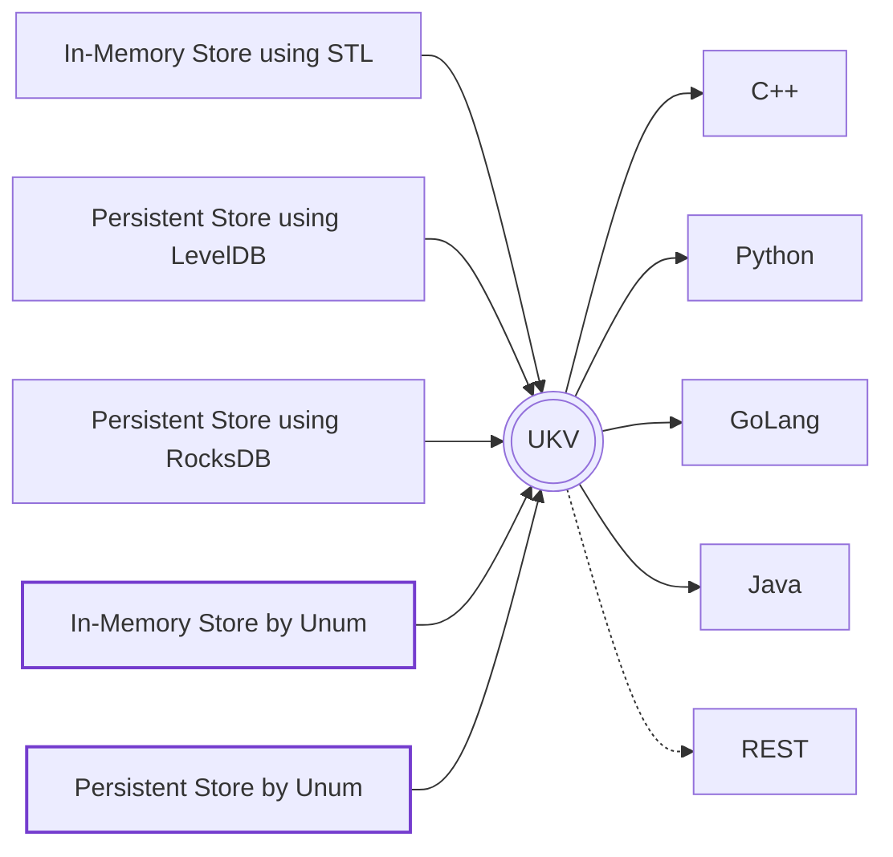

# Universal Key-Values

Imagine having a standardized cross-lingual interface for all your things "Data":

* Storing binary blobs
* Building up graphs & indexes
* Querying structured documents
* Handling JSON, BSON, MsgPacks
* ACID transactional guarantees
* Familiar interfaces for tabular & graph analytics
* Bindings for your favorite languages
* Interoperability with Apache Arrow

UVV does just that, abstracting away the implementation from the user.
In under 10K LOC you get a reference implementation in C++, support for any classical backend, and bindings for [Python](#python), [GoLang](#golang), [Java](#java).

This way you get the freedom to switch between in-memory vs persistent DBs, between ACID and eventually consistent designs without rewriting you application.
All with a better performance than with alternative solutions.



## Backends

Backends differ in their functionality and purposes.
The underlying embedded key value stores include:

| Name    |      OSes       | ACID  | Collections | Persistent |
| :------ | :-------------: | :---: | :---------: | :--------: |
| STL     | POSIX + Windows |   ✅   |      ✅      |     ❌      |
| LevelDB | POSIX + Windows |   ❌   |      ❌      |     ✅      |
| RocksDB | POSIX + Windows |   ✅   |      ✅      |     ✅      |
| UnumDB  |      Linux      |   ✅   |      ✅      |     ✅      |

The STL backend originally served educational purposes, yet, with a proper web-server implementation, is comparable to other in-memory stores like Redis, MemCached or ETCD.
LevelDB is Key-Value stored designed at Google and extensively adopted across the industry.
RocksDB originally forked LevelDB to extend its functionality with transactions, collections, and higher performance.

Future work includes:

* SQL Server
* Distributed Sharded Backend
* GraphQL Server

## Frontends

Currently, at Proo-of-Concept stage, we support only the essential functionality in select programming languages.

| Name      | Transact | Batches | Collections | Docs  | Graphs | Zero-Copy |
| :-------- | :------: | :-----: | :---------: | :---: | :----: | :-------: |
| C++       |    ✅     |    ✅    |      ✅      |   ✅   |   ✅    |     ✅     |
| Python    |    ✅     |    ❌    |      ✅      |   ❌   |   ✅    |     ✅     |
| Java      |    ✅     |    ❌    |      ❌      |   ❌   |   ❌    |     ❌     |
| GoLang    |    ❌     |    ❌    |      ❌      |   ❌   |   ❌    |     ✔️     |
| REST API  |    ✔️     |    ✔️    |      ✔️      |   ✔️   |   ❌    |     ✔️     |
| Arrow RPC |    ✔️     |    ✔️    |      ✔️      |   ✔️   |   ❌    |     ✔️     |

Future work would include:

* Arrow Flight RPC,
* Bindings for C#
* Bindings for Rust
* Bindings for Dart
* Bindings for JavaScript
* Bindings for Wolfram Language
* GoLang Channel [Batch Reads](https://stackoverflow.com/a/36546929)

## Assumptions and Limitations

* Keys are constant length native integer types. High-performance solutions are impossible with variable size keys. 64-bit unsigned integers are currently chosen as the smallest native numeric type, that can address modern datasets.
* Values are serialized into variable-length byte strings.
* Iterators and enumerators often come with certain relevance, consistency or performance tradeoffs or aren't supported at all. Check the specs of exact backend.
* Transactions are ACI(D) by-default, meaning that:
  * Atomicity is guaranteed,
  * Consistency is implemented in the strongest form - tracking all key and metadata lookups by default,
  * Isolation is guaranteed, but may be implemented differently, depending on backend - in-memory systems generally prefer "locking" over "multi-versioning".
  * Durability doesn't apply to in-memory systems, but even in persistent stores its often disabled to be implemented in higher layers of infrastructure.

## Development

To build and test any set of bindings:

1. Build (`cmake . && make`) or download the prebuilt `libukv.a`,
2. Call `./language/run.sh` in your terminal.

### Python

Current implementation relies on [PyBind11](https://github.com/pybind/pybind11).
It's feature-rich, but not very performant, supporting:

* Named Collections
* ACID Transactions
* Single & Batch Operations
* Tensors support via [Buffer Protocol](https://docs.python.org/3/c-api/buffer.html)
* [NetworkX](https://networkx.org)-like interface for Graphs
* [Pandas](https://pandas.pydata.org)-like interface for Document collections

Using it can be as easy as:

```python
import ukv.stl as ukv

db = ukv.DataBase()
db[42] = 'purpose of life'.encode()
db['sub-collection'][0] = db[42]
del db[42]
assert len(db['sub-collection'][0]) == 15
```

All familiar Pythonic stuff!

### Rust

Rust implementation is designed to support:

* Named Collections
* ACID Transactions
* Single & Batch Operations
* [Apache DataFusion](https://arrow.apache.org/datafusion/) `TableProvider` for SQL

Using it should be, again, familiar, as it mimics [`std::collections`](https://doc.rust-lang.org/std/collections/hash_map/struct.HashMap.html):

```rust
let mut db = DataBase::new();
if db.contains_key(&42) {
    db.remove(&42);
    db.insert(43, "New Meaning".to_string());
}
for (key, value) in &db {
    println!("{key}: \"{value}\"");
}
db.clear();
```

### Java

These bindings are implemented via [Java Native Interface](https://docs.oracle.com/javase/8/docs/technotes/guides/jni/spec/jniTOC.html).
This interface is more performant than Python, but is not feature complete yet.
It mimics native `HashMap` and `Dictionary` classes, but has no support for batch operations yet.

```java
DataBase db = new DataBase("");
db.put(42, "purpose of life".getBytes());
assert db.get(42) == "purpose of life".getBytes() : "Big surprise";
db.close();
```

All `get` requests cause memory allocations in Java Runtime and export data into native Java types.
Most `set` requests will simply cast and forward values without additional copies.
Aside from opening and closing this class is **thread-safe** for higher interop with other Java-based tools.

Implementation follows the ["best practices" defined by IBM](https://developer.ibm.com/articles/j-jni/). It was tested with:

* JVM
* *[GraalVM](https://www.graalvm.org/22.1/reference-manual/native-image/JNI/)*

### GoLang

GoLang bindings are implemented using [cGo](https://pkg.go.dev/cmd/cgo).
The language lacks operator and function overloads, so we can't mimic native collections.
Instead we mimic the interfaces of most commonly used ORMs.

```go
db := DataBase{}
db.Reconnect("")
db.Set(42, &[]byte{4, 2})
db.Get(42)
```

Implementation-wise, GoLang variant performs `memcpy`s on essentially every call.
As GoLang has no exceptions in the classical OOP sense, most functions return multiple values, error being the last one in each pack.
Batch lookup operations are implemented via channels sending slices, to avoid reallocations.

### JavaScript

* Node.js
* V8
* Deno
* [`bun:ffi`](https://twitter.com/jarredsumner/status/1521527222514774017)

### RESTful API & Clients

We implement a REST server using `Boost.Beast` and the underlying `Boost.Asio`, as the go-to Web-Dev libraries in C++.
To test the REST API, `./src/run_rest.sh` and then cURL into it:

```sh
curl -X PUT \
  -H "Accept: Application/json" \
  -H "Content-Type: application/octet-stream" \
  0.0.0.0/8080/one/42?col=sub \
  -d 'purpose of life'

curl -i \
  -H "Accept: application/octet-stream" \
  0.0.0.0/8080/one/42?col=sub
```

The [`OneAPI` specification](/openapi.yaml) documentation is in-development.
