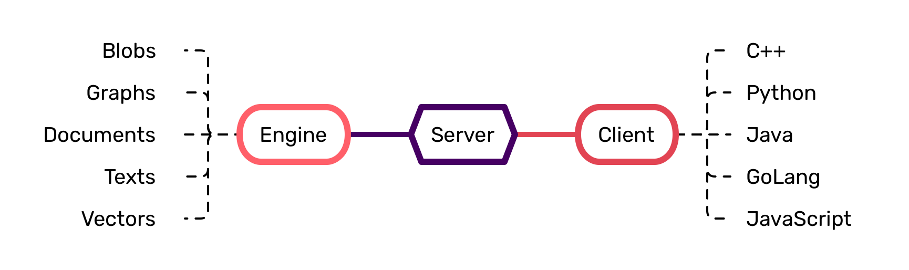

# Universal Keys & Values

* Open Standard for a Binary DBMS Interface
* 100+ Reference Implementations for 
  * RocksDB • LevelDB • UnumDB • RAM ⇌ 
  * Docs • Graphs • Blobs ⇌ 
  * Server • Embedded ⇌ 
  * C • C++ • Python • Java • GoLang

⚠️ Under active development! Not all APIs are stable!

## The [BLAS][blas] of [CRUD][crud]


Imagine having a standardized cross-lingual binary interface for all your things "Data":

* Storing binary blobs
* Building up graphs & indexes
* Querying structured documents
* [ACID][acid] transactions across tables, docs & graphs via one API!
* [Apache Arrow][arrow] interop and [Flight RPC][flight]
* Familiar high-level [drivers](#frontends) for tabular & graph analytics
* Handling JSON, [BSON][bson], [MsgPack][mpack]
* [JSON-Pointers][pointer] & [Field-level Patches][patch], no custom Query Languages
* Packing Tensors for [PyTorch][pytorch] and [TensorFlow][tensorflow]

UKV does just that, [*cheapely*](#performance) abstracting away the implementation from the user.
In under 20K LOC you get a reference implementation in C++, support for any classical backend engine, and bindings for [Python](#python), [GoLang](#golang), [Java](#java).
You can combine every [engine](#engines) with every modality, [frontend](#frontends) and distribution form:

| Engine  | Modality | Distribution                    | Frontend                        |
| :------ | :------- | :------------------------------ | :------------------------------ |
|         |          |                                 |                                 |
| RAM     | Blobs    | Embedded                        | C and C++                       |
| LevelDB | Docs     | Standalone                      | Python                          |
| RocksDB | Graphs   | Distributed <sup>*coming*</sup> | GoLang <sup>*in-progress*</sup> |
| UnumKV  |          |                                 | Java <sup>*in-progress*</sup>   |

## Usecases

Such standartization helps make the system more modular, more flexible.
This single repo can have a hundred use-cases like:

1. Serving [RocksDB][rocksdb] and [LevelDB][leveldb] as a standalone DBMS over RPC.
2. Python, GoLang, Java and other high-level bindings for Terabyte and Petabyte-scale containers distributed across the entire datacenter.
3. Document store, that is simpler and faster than putting JSONs in MongoDB or Postgres.
4. Graph database, with the feel of [NetworkX][networkx], ~~soon~~ speed of [GunRock][gunrock] and scale of [Hadoop][hadoop].
5. Performant ABI-stable embedded store in the foundation of your own DBMS, CDN or even BI pipeline!

But more importantly, if you choose backends that support transactions and collections, you can get an all-in one solution:



It is normal to have a separate Postgres for your transactional data, a MongoDB for your large flexible-schema document collections, a Neo4J instance for your graphs, and an [S3][s3] storage bucket for your media data, all serving the different data needs of a single business.

> Example: a social network, storing passwords in Postgres, posts in MongoDB, user relations in Neo4J and post attachments in S3.

So when the data is updated, you have to apply changes across all those instances, manually rolling them back if one of the parts failed.
Needless to say, every system has a different API, different guarantees, and runtime constraints.
UKV provides something far more uniform, simple, and performant *with the right backend*.
When picking the UnumKV backend, we bring our entire IO stack, bypassing the Linux kernel for storage and networking operations.
This yields speedups not just for small-ish OLTP and mid-size OLAP, but even streaming-out Gigabyte-sized videos.
**One ~~ring~~ data-lake to rule them all.**

[blas]: https://en.wikipedia.org/wiki/Basic_Linear_Algebra_Subprograms
[crud]: https://en.wikipedia.org/wiki/Create,_read,_update_and_delete
[acid]: https://en.wikipedia.org/wiki/ACID
[arrow]: https://arrow.apache.org/
[patch]: https://datatracker.ietf.org/doc/html/rfc6902
[mpack]: https://msgpack.org/index.html
[flight]: https://arrow.apache.org/docs/format/Flight.html
[pointer]: https://datatracker.ietf.org/doc/html/rfc6901
[bson]: https://www.mongodb.com/json-and-bson
[pytorch]: https://pytorch.org/
[tensorflow]: https://tensorflow.org
[rocksdb]: https://rocksdb.org
[leveldb]: https://github.com/google/leveldb
[hadoop]: https://hadoop.apache.org
[networkx]: https://networkx.org
[gunrock]: https://gunrock.github.io
[s3]: https://aws.amazon.com/s3

## Performance

Over the years we broke speed limits on CPUs and GPUs using SIMD, branch-less computing and innovation in parallel algorithm design.
You won't find `virtual`, `override` or `throw` even in our FOSS reference implementation.
Dynamic allocations are minimized and generally happen within specialized small arenas.

> Performance is a tricky topic, if you want more details, here is a sequence of blog posts:.

What it means for you?

### Benchmarking on Twitter JSONs

Ingestion speed:

* MongoDB: 2'000 tweets/s.
* MongoDB with `mongoimport`: 10'000 tweets/s.
* UKV: FOSS RocksDB + FOSS JSON modality: 11'000 tweets/s.
* UKV: proprietary UnumKV + FOSS JSON modality: 42'000 tweets/s.
* UKV: proprietary UnumKV + proprietary JSON modality: 60'000 tweets/s.

All of UKV interfaces look same, but work different.
It is a modular system you can assemble the way you like!

Gathering Speeds:

* MongoDB: 2'000 tweets/s.
* MongoDB with `mongoimport`: 10'000 tweets/s.
* UKV: FOSS RocksDB + FOSS JSON modality: 11'000 tweets/s.
* UKV: proprietary UnumKV + FOSS JSON modality: 42'000 tweets/s.
* UKV: proprietary UnumKV + proprietary JSON modality: 60'000 tweets/s.

Aside from lookups and gathers, we support random sampling for Machine Learning applications.

### Benchmarking on Bitcoin Graph

Ingestion speed:

* Neo4J:
* ArangoDB:
* TigerGraph:
* UKV: FOSS RocksDB + FOSS Graph modality: 
* UKV: proprietary UnumKV + FOSS Graph modality: 
* UKV: proprietary UnumKV + proprietary Graph modality: 

Gathering Speeds:

* Neo4J:
* ArangoDB:
* TigerGraph:
* UKV: FOSS RocksDB + FOSS Graph modality: 
* UKV: proprietary UnumKV + FOSS Graph modality: 
* UKV: proprietary UnumKV + proprietary Graph modality: 

## Engines

Backends differ in their functionality and purposes.
The underlying embedded key value stores include:

| Name    |  Speed   |       OS        | Transact | Collections | Persistent | [Snapshots][2] | [Watches][1] |
| :------ | :------: | :-------------: | :------: | :---------: | :--------: | :------------: | :----------: |
| RAM     | **10x**  | POSIX + Windows |    ✅     |      ✅      |     ❌      |       ❌        |      ✅       |
| LevelDB |   0.5x   | POSIX + Windows |    ❌     |      ❌      |     ✅      |       ❌        |      ❌       |
| RocksDB |    1x    | POSIX + Windows |    ✅     |      ✅      |     ✅      |       ✅        |      ✅       |
| UnumKV  | **3-5x** |      Linux      |    ✅     |      ✅      |     ✅      |       ✅        |      ✅       |


* RAM in-memory backend was originally served educational purposes. Then it was superseeded by the [`consistent_set`][consistent_set] and can now be considered the fastest in-memory Key-Value Store, superior to Redis, MemCached or ETCD.
* LevelDB was originally designed at Google and extensively used across the industry, thanks to its simplicity.
* RocksDB improves over LevelDB, extending its functionality with transactions, named collections, and higher performance.
* UnumKV is our proprietary in-house implementation with superior concurrency and kernel-bypass techniques, as well as, GPU acceleration.

All of those backends were [benchmarked for weeks](https://unum.cloud/ucsb) using [UCSB](https://github.com/unum-cloud/ucsb), so you can choose the best stack for you specific use case.


[1]: https://redis.io/commands/watch/
[2]: https://github.com/facebook/rocksdb/wiki/Snapshot
[acid]: https://en.wikipedia.org/wiki/ACID
[consistent_set]: https://github.com/ashvardanian/consistent_set

## Frontends

Currently, at Proof-of-Concept stage, we support only the essential functionality in select programming languages.

| Name        | Transact | Collections | Batches | Docs  | Graphs | Copies |
| :---------- | :------: | :---------: | :-----: | :---: | :----: | :----: |
| C ³         |    ✅     |      ✅      |    ✅    |   ✅   |   ✅    |   0    |
| C++ ³       |    ✅     |      ✅      |    ✅    |   ✅   |   ✅    |   0    |
| Python ¹ ³  |    ✅     |      ✅      |    ✅    |   ✅   |   ✅    |  0-1   |
| Arrow RPC ³ |    ✅     |      ✅      |    ✅    |   ✅   |   ✅    |  0-2   |
| GoLang      |    ✅     |      ✅      |    ✅    |   ❌   |   ❌    |   1    |
| Java        |    ✅     |      ✅      |    ❌    |   ❌   |   ❌    |   1    |
|             |          |             |         |       |        |        |
| C# ²        |    ❌     |      ❌      |    ❌    |   ❌   |   ❌    |        |
| REST API ²  |    ❌     |      ❌      |    ❌    |   ❌   |   ❌    |        |
| Wolfram ¹ ² |    ❌     |      ❌      |    ❌    |   ❌   |   ❌    |        |

* Copies: Number of re-allocations/conversions per byte.
* ¹: Support tensor lookups and media data.
* ²: Missing, to be implemented.
* ³: Supports tabular Arrow exports.

## Modalities

We came from humble beginnings.
We just wanted to standardize binary Key-Value operations.
Integer keys, variable length values.
That's it.

You can also think of such a KVS as a memory-allocator:

* The key is a 64-bit integer, just like a pointer on most modern systems.
* The value is the variable length block, addressed by it.

Once you have a good enough shared interface, it is relatively easy to build on top of it, adding support for:

* Documents, 
* Graphs,
* Vectors, and
* Paths.

Is there something else you need?
Submit a feature request!

## Installation & Deployment

* For Python: `pip install ukv`
* For Conan: `conan install ukv`
* For Docker image: `docker run --rm --name test_ukv -p 38709:38709 unum/ukv`

To build from source:

```sh
cmake \
    -DUKV_BUILD_PYTHON=1 \
    -DUKV_BUILD_TESTS=1 \
    -DUKV_BUILD_BENCHMARKS=1 \
    -DUKV_BUILD_FLIGHT_RPC=1 . && \
    make -j16
```

For Flight RPC, Apache Arrow must be pre-installed.

To build language bindings:

```sh
./python/run.sh
./java/run.sh
./golang/run.sh
```

Building Flight RPC Docker Image:

```sh
docker build -t ukv .
```

Building Conan package, without installing it:

```sh
conan create . ukv/testing --build=missing
```

* To see a usage examples, check the [C][c-example] API and the [C++ API](cpp-example) tests.
* To read the documentation, [check unum.cloud/ukv](https://unum.cloud/UKV).
* To contribute to the development, [check the `src/`](https://github.com/unum-cloud/UKV/blob/main/src).

[c-example]: https://github.com/unum-cloud/UKV/blob/main/tests/compilation.cpp
[cpp-example]: https://github.com/unum-cloud/UKV/blob/main/tests/compilation.cpp

## Similar Projects

* [EJDB](https://github.com/Softmotions/ejdb) is a pure C embeddable JSON database engine.
  * **Pros**:
    * C11 API.
    * Many bindings, including JS and *currently* better Java support.
    * MacOS and Windows support, that we *currently* don't prioritize.
  * **Cons**:
    * Very slow.
    * No ACID transactions.
    * No way to swap the backend "engine".
    * No support for non-document modalities, like Graphs.
    * No support for batch operations.
    * Bindings are just string exchange interfaces.
* [SurrealDB](https://github.com/surrealdb/surrealdb) is a scalable, distributed, collaborative, document-graph database, for the realtime web.
  * **Pros**:
    * Many bindings, including JS.
    * MacOS and Windows support, that we *currently* don't prioritize.
    * User permissions management functionality.
  * **Cons**:
    * Very slow.
    * No way to swap the backend "engine".
    * Custom string-based query language.
    * Bindings are just string exchange interfaces.
    * No C API [yet](https://surrealdb.com/docs/integration/libraries/c).

## Presets, Limitations and FAQ

* Keys are 64-bit integers. Use "paths" modality for string keys. [Why?](ukv_key_t)
* Values are binary strings under 4 GB long. [Why?](ukv_length_t)
* Transactions are ACI(D) by-default. [What does it mean?](ukv_transaction_t)
* Why not use LevelDB or RocksDB interface? [](ukv.h)
* Why not use SQL, MQL or Cypher? [](ukv.h)
