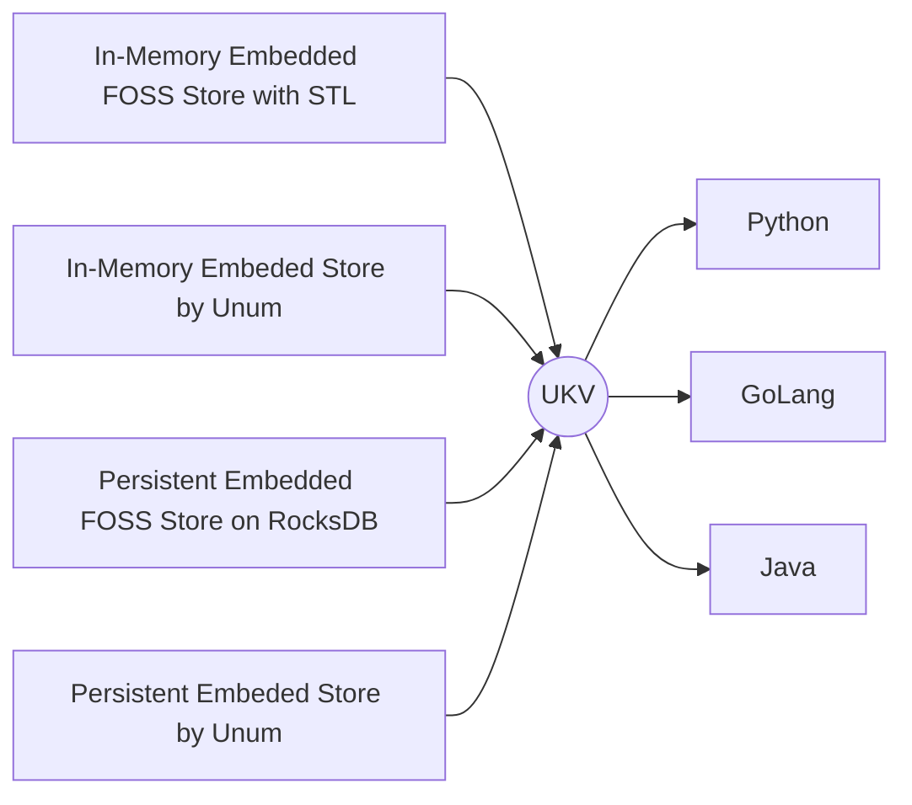

# Universal Key-Values

Universal Key-Value store interface for both in-memory and persistent ACID transactional collections written in C/C++ and Assembly with bindings for [Python](#python), [GoLang](#golang), [Java](#java), JavaScript, C#.



## Development

To build and test any set of bindings:

1. Build (`cmake . && make`) or download the prebuilt `libukv.a`,
2. Call `./language/run.sh` in your terminal.

### Python

Current impleentation relies on [PyBind11](https://github.com/pybind/pybind11).
It's feature-rich, but not very performant, supporting:

* Named Collections
* Transactions
* Single & *Batch* Operations
* *Tensor Exports*

Using it can be as easy as:

```python
import ukv

db = ukv.DataBase()
db[42] = 'purpose of life'.encode()
db['sub-collection'][0] = db[42]
del db[42]
assert len(db['sub-collection'][0]) == 15
```

All familiar Pythonic stuff!

### Java

These bindings are impemented via [Java Native Interface](https://docs.oracle.com/javase/8/docs/technotes/guides/jni/spec/jniTOC.html).
This interface is more performant than Python, but is feature complete yet.
It mimics native `HashMap` and `Ditionary` classes, but has no support for batch operations yet.

```java
DataBase db = new DataBase("");
db.put(42, "purpose of life".getBytes());
assert db.get(42) == "purpose of life".getBytes() : "Big surprise";
db.close();
```

### GoLang

GoLang bindings are implemented using [cGo](https://pkg.go.dev/cmd/cgo).
The language lacks operator and function overloads, so we can't mimic native collections.
Instead we mimic the interfaces of most commonly used ORMs.

```go
db := database{}
db.Reconnect("")
db.Set(42, &[]byte{4, 2})
db.Get(42)
```

Implementation-wise, GoLang variant performs `memcpy`s on essentially every call.
As GoLang has no exceptions in the classical OOP sense, most functions return multiple values, error being the last one in each pack.
Batch lookup operations are imlemented via channels sending slices, to avoid reallocations.
